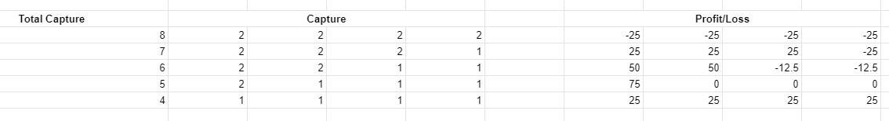

# Fishing eqilibrium

## Stack

- Vue
- Express

## Brainstorming

- How the game works?
  - 4 teams
    - team has a name
    - each team consists of 3 players
    - each team has one team leader
  - 12 players in total
    - players has a name
  - 8 days of fishing
  - each day a team can catch either 1 or two fishes
- 

- stretch
  - last two days are festiv days - profit/loss incurred is doubled
- At the end of eight days , team with most money wins
